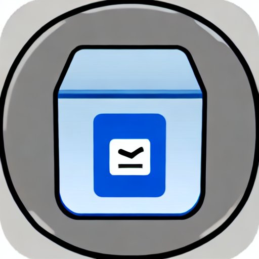

# お箱(ohako)

以下の2つを参考にして作られた自作RDMSです。

* 米国カーネギーメロン大学（Carnegie Mellon University）で開講されている講義「[Database Systems](https://15445.courses.cs.cmu.edu/fall2022/)」
    * [bustub](https://github.com/cmu-db/bustub)
    * [go-bustub](https://github.com/brunocalza/go-bustub)
* WEB+DB PRESS Vol.122の特集3「作って学ぶRDBMSのしくみ」
    * [relly](https://github.com/KOBA789/relly)
    * [my-relly-go](https://github.com/genms/my-relly-go)

